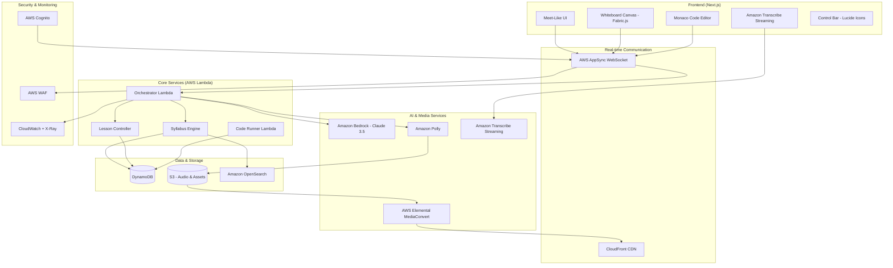

# Design Document: InkFlow AI

## Overview

InkFlow AI is a structured 1-on-1 AI tutoring platform following a "Google Meet for AI Tutoring" philosophy. The platform prioritizes a "Syllabus-First" teaching engine, synchronizing Amazon Polly audio with Fabric.js handwriting and Monaco code typing.

The architecture leverages a comprehensive AWS serverless stack with Next.js frontend, AWS AppSync for real-time communication, Amazon Bedrock for AI content generation, and a suite of AWS services for media processing, security, and observability.

## Architecture

### High-Level Architecture



### AWS Service Integration Architecture

The system leverages AWS services for scalability, reliability, and performance optimization:

**Frontend Layer:**
- **Next.js**: React-based frontend with server-side rendering
- **AWS AppSync**: GraphQL API with real-time WebSocket subscriptions
- **CloudFront**: Global CDN for static assets and media delivery

**Compute Layer:**
- **AWS Lambda**: Serverless compute for all backend logic
- **Amazon Bedrock**: Claude 3.5 for syllabus generation and content creation
- **Code Runner Lambda**: Isolated sandbox for student code execution

**Data Layer:**
- **Amazon DynamoDB**: Session state and progress persistence
- **Amazon S3**: Audio files, SVG assets, and media storage
- **Amazon OpenSearch**: Content search and analytics

**Media & Communication:**
- **Amazon Polly**: Text-to-speech with Speech Marks for synchronization
- **Amazon Transcribe Streaming**: Real-time voice activity detection
- **AWS Elemental MediaConvert**: Audio optimization and compression

## Core Components

### 1. AWS Lambda Orchestrator

**Design Rationale:** The Orchestrator serves as the central coordinator, managing the flow between Amazon Bedrock for content generation, Amazon Polly for audio synthesis, and AWS AppSync for real-time delivery.

**Implementation:**
- **Bedrock Integration:** Invokes Claude 3.5 for syllabus generation and contextual responses
- **Session Management:** Stores session_plan and progress in DynamoDB
- **Real-time Streaming:** Publishes Teaching_Blocks via AppSync WebSocket subscriptions
- **Interruption Handling:** Coordinates with Transcribe Streaming for VAD responses

**Key Functions:**
```typescript
interface OrchestratorLambda {
  generateSyllabus(topic: string): Promise<SyllabusItem[]>
  handleUserInterruption(context: InterruptionContext): Promise<TeachingBlock>
  streamTeachingBlock(block: TeachingBlock): Promise<void>
  manageSessionState(sessionId: string, updates: SessionUpdate): Promise<void>
}
```

### 2. Teaching Block System with AWS Integration

**Design Rationale:** Teaching_Blocks now include S3 URLs for Polly-generated audio and are optimized for AppSync streaming with minimal payload size.

**Enhanced Teaching_Block Structure:**
```typescript
interface TeachingBlock {
  block_id: string
  type: 'SYLLABUS' | 'THEORY' | 'DEMO' | 'TASK'
  content: {
    audio_text: string
    audio_url: string // S3 URL from Polly
    speech_marks: PollyMark[] // For synchronization
    handwriting_svg?: SVGPath[]
    code_snippet?: string
    syllabus_list?: string[]
  }
  ui_state: {
    whiteboard_active: boolean
    editor_locked: boolean
    auto_advance: boolean
    expected_patterns?: string[]
  }
  timing: {
    audio_duration: number
    animation_sync_points: number[]
  }
  metadata: {
    s3_bucket: string
    cloudfront_url: string
    created_at: string
  }
}
```

### 3. Syllabus Engine with Amazon Bedrock

**Design Rationale:** Amazon Bedrock (Claude 3.5) provides sophisticated reasoning for topic dependency mapping and educational content structuring.

**Bedrock Integration:**
```typescript
interface SyllabusEngine {
  bedrockClient: BedrockRuntimeClient
  
  async generateLessonPlan(topic: string): Promise<SyllabusItem[]> {
    const prompt = this.buildSyllabusPrompt(topic)
    const response = await this.bedrockClient.invokeModel({
      modelId: 'anthropic.claude-3-5-sonnet-20241022-v2:0',
      body: JSON.stringify({
        anthropic_version: 'bedrock-2023-05-31',
        messages: [{ role: 'user', content: prompt }],
        max_tokens: 4000
      })
    })
    return this.parseSyllabusResponse(response)
  }
  
  classifyQuery(query: string): 'broad' | 'narrow'
  organizeDependencies(topics: string[]): SyllabusItem[]
}
```

### 4. Interactive Whiteboard with S3 Asset Management

**Design Rationale:** Fabric.js canvas integrates with S3-hosted SVG assets and CloudFront CDN for global performance optimization.

**Implementation Details:**
- **Canvas Setup:** Deep indigo background (#1e1b4b) with Fabric.js v5
- **Asset Pipeline:** SVG paths bundled in Teaching_Blocks, cached via CloudFront
- **Polly Speech Marks:** Precise synchronization using Amazon Polly's SSML marks
- **Framer Motion:** Smooth transitions between whiteboard and code editor modes

**Whiteboard System with AWS Integration:**
```typescript
interface WhiteboardSystem {
  fabricCanvas: fabric.Canvas
  s3Client: S3Client
  
  async renderSVGAnimation(paths: SVGPath[], speechMarks: PollyMark[]): Promise<void>
  syncWithPollyAudio(audioUrl: string, marks: PollyMark[]): void
  addLaserPointer(path: SVGPath): void
  transitionToCodeMode(): Promise<void>
  
  // S3 integration for asset caching
  cacheAssetsToS3(svgPaths: SVGPath[]): Promise<string[]>
}
```

### 5. Monaco Code Editor with Lambda Code Runner

**Design Rationale:** Monaco editor provides VS Code experience while the isolated Code Runner Lambda ensures secure execution without VPC or internet access.

**Code Runner Lambda Security:**
```typescript
interface CodeRunnerLambda {
  // IAM Role: Zero VPC access, no internet gateway
  // Runtime: Node.js 18 with 30-second timeout
  // Memory: 512MB maximum
  
  executeCode(code: string, language: string): Promise<ExecutionResult>
  validateSolution(code: string, patterns: string[]): Promise<ValidationResult>
  
  // Security constraints
  readonly iamRole: {
    policies: ['AWSLambdaBasicExecutionRole'] // No VPC or internet access
    trustPolicy: 'lambda.amazonaws.com'
  }
}

interface ExecutionResult {
  stdout: string
  stderr: string
  exitCode: number
  executionTime: number
  memoryUsed: number
}
```

**Monaco Integration:**
```typescript
interface CodeEditorConfig {
  theme: 'vs-dark'
  language: string
  readOnly: boolean
  typewriterSpeed: number // Calculated from audio_duration
  appSyncEndpoint: string // For code execution requests
}
```

### 6. Voice Activity Detection with Amazon Transcribe Streaming

**Design Rationale:** Amazon Transcribe Streaming provides enterprise-grade VAD with real-time processing and automatic language detection.

**Transcribe Streaming Integration:**
```typescript
interface VADSystem {
  transcribeClient: TranscribeStreamingClient
  
  async startListening(): Promise<void> {
    const stream = await this.transcribeClient.startStreamTranscription({
      LanguageCode: 'en-US',
      MediaSampleRateHertz: 16000,
      MediaEncoding: 'pcm',
      EnablePartialResultsStabilization: true,
      PartialResultsStability: 'medium'
    })
    
    stream.TranscriptResultStream?.on('data', this.handleTranscriptEvent)
  }
  
  handleTranscriptEvent(event: TranscriptEvent): void
  pauseAllAnimations(): void
  clearPendingBlocks(): void
  resumeFromInterruption(): void
}
```

### 7. Session State Management with DynamoDB

**Design Rationale:** DynamoDB provides single-digit millisecond latency for session state with automatic scaling and global tables for multi-region deployment.

**DynamoDB Schema Design:**
```typescript
interface SessionTable {
  PK: string // SESSION#{sessionId}
  SK: string // METADATA | PROGRESS#{topicIndex} | ATTEMPT#{attemptId}
  
  // Session metadata
  userId: string
  lessonPlan: SyllabusItem[]
  currentTopicIndex: number
  createdAt: string
  lastActivity: string
  
  // Progress tracking
  completedTopics: string[]
  userAttempts: CodeAttempt[]
  interruptionContext?: InterruptionState
  
  // TTL for automatic cleanup
  ttl: number // 7 days from last activity
}

interface LessonController {
  dynamoClient: DynamoDBClient
  
  async saveSessionPlan(sessionId: string, plan: SyllabusItem[]): Promise<void>
  async updateProgress(sessionId: string, topicIndex: number): Promise<void>
  async handleAutoAdvance(sessionId: string): Promise<TeachingBlock | null>
  async getSessionState(sessionId: string): Promise<SessionState>
}
```

## Security & Identity Management

### AWS Cognito Integration

**Design Rationale:** AWS Cognito provides enterprise-grade authentication with JWT tokens and fine-grained access control for AppSync operations.

**Authentication Flow:**
```typescript
interface CognitoAuth {
  userPool: CognitoUserPool
  identityPool: CognitoIdentityPool
  
  async signUp(email: string, password: string): Promise<CognitoUser>
  async signIn(email: string, password: string): Promise<AuthenticationResult>
  async refreshToken(refreshToken: string): Promise<string>
  async signOut(): Promise<void>
}

// AppSync Authorization
interface AppSyncAuth {
  authMode: 'AMAZON_COGNITO_USER_POOLS'
  cognitoUserPoolConfig: {
    userPoolId: string
    awsRegion: string
    defaultAction: 'ALLOW'
  }
}
```

### IAM Security Model

**Design Rationale:** Principle of least privilege with role-based access control ensures Code Runner isolation and prevents data exfiltration.

**IAM Roles:**
```typescript
interface SecurityRoles {
  // Code Runner - Maximum security isolation
  codeRunnerRole: {
    policies: ['AWSLambdaBasicExecutionRole']
    networkAccess: 'NONE' // No VPC, no internet gateway
    resourceAccess: 'NONE' // Cannot access S3, DynamoDB, or other services
    executionTimeout: 30 // seconds
    memoryLimit: 512 // MB
  }
  
  // Orchestrator - Limited service access
  orchestratorRole: {
    policies: [
      'AWSLambdaBasicExecutionRole',
      'BedrockInvokeModel',
      'PollyFullAccess',
      'DynamoDBSessionAccess',
      'S3AudioBucketAccess'
    ]
  }
  
  // Frontend - AppSync access only
  authenticatedUserRole: {
    policies: ['AppSyncInvokeAccess']
    resources: ['arn:aws:appsync:*:*:apis/*/types/*/fields/*']
  }
}
```

### AWS WAF Protection

**Design Rationale:** Web Application Firewall protects AppSync endpoints from common attacks and implements rate limiting.

**WAF Configuration:**
```typescript
interface WAFRules {
  sqlInjectionRule: {
    name: 'SQLInjectionRule'
    priority: 1
    statement: {
      sqliMatchStatement: {
        fieldToMatch: { body: {} }
        textTransformations: ['URL_DECODE', 'HTML_ENTITY_DECODE']
      }
    }
    action: 'BLOCK'
  }
  
  rateLimitRule: {
    name: 'RateLimitRule'
    priority: 2
    statement: {
      rateBasedStatement: {
        limit: 2000 // requests per 5-minute window
        aggregateKeyType: 'IP'
      }
    }
    action: 'BLOCK'
  }
  
  geoBlockRule: {
    name: 'GeoBlockRule'
    priority: 3
    statement: {
      geoMatchStatement: {
        countryCodes: ['CN', 'RU'] // Block high-risk countries
      }
    }
    action: 'BLOCK'
  }
}
```

## Media Processing & Optimization

### Amazon Polly Integration

**Design Rationale:** Polly provides natural-sounding speech with Speech Marks for precise audio-visual synchronization.

**Polly Configuration:**
```typescript
interface PollyService {
  client: PollyClient
  
  async synthesizeSpeech(text: string): Promise<PollyOutput> {
    const params = {
      Text: text,
      OutputFormat: 'mp3',
      VoiceId: 'Joanna', // Neural voice for natural sound
      Engine: 'neural',
      SampleRate: '22050',
      TextType: 'ssml' // Support for Speech Marks
    }
    
    // Generate both audio and speech marks
    const [audioResult, marksResult] = await Promise.all([
      this.client.synthesizeSpeech(params),
      this.client.synthesizeSpeech({
        ...params,
        OutputFormat: 'json',
        SpeechMarkTypes: ['word', 'sentence', 'ssml']
      })
    ])
    
    return {
      audioStream: audioResult.AudioStream,
      speechMarks: JSON.parse(marksResult.AudioStream.toString()),
      s3Key: await this.uploadToS3(audioResult.AudioStream)
    }
  }
}
```

### AWS Elemental MediaConvert

**Design Rationale:** MediaConvert optimizes Polly audio for different network conditions and global delivery via CloudFront.

**MediaConvert Job Template:**
```typescript
interface MediaConvertJob {
  jobTemplate: {
    name: 'InkFlowAudioOptimization'
    settings: {
      inputs: [{
        fileInput: 's3://inkflow-polly-raw/audio.mp3'
      }]
      outputGroups: [
        {
          name: 'HighQuality'
          outputs: [{
            containerSettings: { container: 'MP3' }
            audioDescriptions: [{
              codecSettings: {
                codec: 'MP3'
                mp3Settings: {
                  bitrate: 128000
                  channels: 2
                  sampleRate: 22050
                }
              }
            }]
          }]
        },
        {
          name: 'LowBandwidth'
          outputs: [{
            containerSettings: { container: 'MP3' }
            audioDescriptions: [{
              codecSettings: {
                codec: 'MP3'
                mp3Settings: {
                  bitrate: 64000
                  channels: 1
                  sampleRate: 16000
                }
              }
            }]
          }]
        }
      ]
    }
  }
}
```

### CloudFront CDN Configuration

**Design Rationale:** Global content delivery with edge caching reduces latency for audio files and static assets.

**CloudFront Distribution:**
```typescript
interface CloudFrontConfig {
  distribution: {
    origins: [
      {
        id: 'S3-InkFlow-Audio'
        domainName: 'inkflow-audio.s3.amazonaws.com'
        s3OriginConfig: {
          originAccessIdentity: 'origin-access-identity/cloudfront/ABCDEFG1234567'
        }
      }
    ]
    defaultCacheBehavior: {
      targetOriginId: 'S3-InkFlow-Audio'
      viewerProtocolPolicy: 'redirect-to-https'
      cachePolicyId: 'CachingOptimized'
      compress: true
      allowedMethods: ['GET', 'HEAD']
    }
    priceClass: 'PriceClass_All' // Global edge locations
    enabled: true
  }
}
```

## Observability & Monitoring

### AWS X-Ray Distributed Tracing

**Design Rationale:** X-Ray provides end-to-end request tracing to identify bottlenecks in the 2-second latency requirement for Teaching_Block generation.

**X-Ray Integration:**
```typescript
interface XRayTracing {
  // Trace the critical path: Frontend → AppSync → Lambda → Bedrock
  traceSegments: {
    appSyncSegment: {
      name: 'AppSync-GraphQL-Request'
      annotations: {
        operation: string
        userId: string
        sessionId: string
      }
    }
    
    orchestratorSegment: {
      name: 'Lambda-Orchestrator'
      subsegments: [
        'Bedrock-Invoke',
        'Polly-Synthesis',
        'DynamoDB-Write',
        'S3-Upload'
      ]
    }
    
    bedrockSegment: {
      name: 'Bedrock-Claude-Generation'
      annotations: {
        modelId: 'anthropic.claude-3-5-sonnet-20241022-v2:0'
        inputTokens: number
        outputTokens: number
        latency: number
      }
    }
  }
}
```

### CloudWatch Monitoring & Alarms

**Design Rationale:** Proactive monitoring ensures the platform meets performance SLAs and identifies issues before they impact users.

**CloudWatch Alarms:**
```typescript
interface CloudWatchAlarms {
  teachingBlockLatencyAlarm: {
    alarmName: 'InkFlow-TeachingBlock-HighLatency'
    metricName: 'Duration'
    namespace: 'AWS/Lambda'
    dimensions: {
      FunctionName: 'InkFlow-Orchestrator'
    }
    threshold: 2500 // milliseconds
    comparisonOperator: 'GreaterThanThreshold'
    evaluationPeriods: 2
    period: 60
    statistic: 'Average'
    alarmActions: ['arn:aws:sns:us-east-1:123456789012:inkflow-alerts']
  }
  
  codeRunnerErrorAlarm: {
    alarmName: 'InkFlow-CodeRunner-HighErrorRate'
    metricName: 'Errors'
    namespace: 'AWS/Lambda'
    dimensions: {
      FunctionName: 'InkFlow-CodeRunner'
    }
    threshold: 5 // errors per minute
    comparisonOperator: 'GreaterThanThreshold'
    evaluationPeriods: 1
    period: 60
    statistic: 'Sum'
  }
  
  dynamoDbThrottleAlarm: {
    alarmName: 'InkFlow-DynamoDB-Throttling'
    metricName: 'ThrottledRequests'
    namespace: 'AWS/DynamoDB'
    dimensions: {
      TableName: 'InkFlow-Sessions'
    }
    threshold: 0
    comparisonOperator: 'GreaterThanThreshold'
  }
}
```

### CloudWatch Logs Configuration

**Design Rationale:** Structured logging enables efficient debugging and performance analysis across all system components.

**Logging Strategy:**
```typescript
interface LoggingConfig {
  lambdaLogs: {
    logLevel: 'INFO'
    logFormat: 'JSON'
    logRetention: 30 // days
    
    structuredLogging: {
      requestId: string
      userId: string
      sessionId: string
      operation: string
      duration: number
      error?: string
    }
  }
  
  appSyncLogs: {
    fieldLogLevel: 'ALL'
    excludeVerboseContent: false
    logRetention: 14 // days
  }
  
  codeRunnerLogs: {
    logLevel: 'ERROR' // Only log errors for security
    logRetention: 7 // days
    
    // Never log user code content for privacy
    sanitizedLogging: {
      executionTime: number
      memoryUsed: number
      exitCode: number
      errorType?: string // Generic error classification only
    }
  }
}
```

## Content Search & Analytics

### Amazon OpenSearch Integration

**Design Rationale:** OpenSearch enables full-text search across lesson transcripts and provides analytics for learning pattern analysis.

**OpenSearch Configuration:**
```typescript
interface OpenSearchService {
  cluster: {
    version: '2.3'
    instanceType: 't3.small.search'
    instanceCount: 2
    dedicatedMasterEnabled: false
    zoneAwarenessEnabled: true
  }
  
  indexMapping: {
    teachingBlocks: {
      properties: {
        sessionId: { type: 'keyword' }
        userId: { type: 'keyword' }
        blockId: { type: 'keyword' }
        blockType: { type: 'keyword' }
        audioText: { 
          type: 'text'
          analyzer: 'standard'
          search_analyzer: 'standard'
        }
        codeSnippet: {
          type: 'text'
          analyzer: 'keyword'
        }
        timestamp: { type: 'date' }
        topicName: { type: 'keyword' }
        completionStatus: { type: 'keyword' }
      }
    }
  }
  
  async indexTeachingBlock(block: TeachingBlock, sessionId: string): Promise<void>
  async searchContent(query: string, userId: string): Promise<SearchResult[]>
  async getSessionAnalytics(sessionId: string): Promise<SessionAnalytics>
}
```

**Search UI Integration:**
```typescript
interface SearchInterface {
  // Frontend search component
  searchBar: {
    placeholder: 'Search your lessons...'
    autoComplete: true
    filters: ['topic', 'date', 'blockType']
  }
  
  searchResults: {
    highlighting: true
    snippetLength: 150
    maxResults: 20
    
    resultFormat: {
      title: string // Topic name
      snippet: string // Highlighted text
      timestamp: string // When this was taught
      sessionId: string // Link back to session
      blockType: 'THEORY' | 'DEMO' | 'TASK'
    }
  }
  
  // Jump to specific timestamp in previous session
  async jumpToTimestamp(sessionId: string, blockId: string): Promise<void>
}
```

## User Interface Design

### Next.js Meet-Like Interface

**Design Rationale:** Next.js provides server-side rendering for optimal performance while maintaining the Google Meet-inspired design philosophy.

**Layout Specifications:**
- **Main Stage:** 90% of screen height allocated to split-pane content
- **Whiteboard Panel:** Left side with Fabric.js canvas (deep indigo background)
- **Code Editor Panel:** Right side with Monaco editor (VS Code Dark theme)
- **Control Bar:** Bottom 10% with glass-style floating design using Lucide React icons
- **Framer Motion:** Smooth transitions between UI states

**Next.js Component Architecture:**
```typescript
// pages/_app.tsx
interface InkFlowApp {
  providers: [
    'CognitoAuthProvider',
    'AppSyncProvider',
    'SessionStateProvider'
  ]
  
  layout: {
    mainStage: '90vh'
    controlBar: '10vh'
    splitPane: {
      left: 'WhiteboardPanel'
      right: 'CodeEditorPanel'
      ratio: '50:50'
    }
  }
}

// components/WhiteboardPanel.tsx
interface WhiteboardPanel {
  fabricCanvas: fabric.Canvas
  svgRenderer: SVGAnimationRenderer
  pollySync: PollyAudioSync
  
  // Framer Motion animations
  variants: {
    active: { x: 0, opacity: 1 }
    hidden: { x: '-100%', opacity: 0 }
  }
}

// components/CodeEditorPanel.tsx
interface CodeEditorPanel {
  monacoEditor: monaco.editor.IStandaloneCodeEditor
  typewriterEffect: TypewriterRenderer
  codeRunner: AppSyncCodeRunner
  
  // Dynamic typewriter speed based on audio_duration
  calculateTypewriterSpeed(audioLength: number, codeLength: number): number
}
```

### Control Bar with Lucide Icons

**Design Rationale:** Lucide React provides consistent, professional iconography without emoji usage, maintaining the Meet-like aesthetic.

**Control Implementation:**
```typescript
interface ControlBar {
  // Glass-style floating bar
  style: {
    background: 'rgba(255, 255, 255, 0.1)'
    backdropFilter: 'blur(10px)'
    border: '1px solid rgba(255, 255, 255, 0.2)'
    borderRadius: '12px'
    position: 'fixed'
    bottom: '20px'
    left: '50%'
    transform: 'translateX(-50%)'
  }
  
  controls: [
    {
      icon: 'Mic' // Lucide React
      action: 'toggleVAD'
      state: 'active' | 'muted'
    },
    {
      icon: 'Camera' // Future video capability
      action: 'toggleCamera'
      state: 'off' // Placeholder
    },
    {
      icon: 'Hand' // Interrupt mechanism
      action: 'raiseHand'
      state: 'normal' | 'raised'
    },
    {
      icon: 'PhoneOff' // End session
      action: 'endSession'
      state: 'normal'
    }
  ]
}
```

## Infrastructure as Code (AWS CDK)

### CDK Stack Architecture

**Design Rationale:** AWS CDK provides type-safe infrastructure definition with reusable constructs for consistent deployments across environments.

**Main Stack Structure:**
```typescript
// lib/inkflow-stack.ts
export class InkFlowStack extends Stack {
  constructor(scope: Construct, id: string, props?: StackProps) {
    super(scope, id, props)
    
    // Core infrastructure
    const auth = new CognitoAuthConstruct(this, 'Auth')
    const api = new AppSyncApiConstruct(this, 'Api', { auth })
    const compute = new LambdaComputeConstruct(this, 'Compute', { api })
    const storage = new StorageConstruct(this, 'Storage')
    const media = new MediaProcessingConstruct(this, 'Media', { storage })
    const monitoring = new MonitoringConstruct(this, 'Monitoring', { compute })
    const search = new OpenSearchConstruct(this, 'Search')
    
    // Security
    const waf = new WAFConstruct(this, 'WAF', { api })
    const security = new SecurityConstruct(this, 'Security', { auth, compute })
  }
}
```

**CDK Constructs:**
```typescript
// constructs/appsync-api-construct.ts
export class AppSyncApiConstruct extends Construct {
  public readonly api: GraphqlApi
  
  constructor(scope: Construct, id: string, props: AppSyncApiProps) {
    super(scope, id)
    
    this.api = new GraphqlApi(this, 'InkFlowApi', {
      name: 'InkFlow-GraphQL-API',
      schema: SchemaFile.fromAsset('schema.graphql'),
      authorizationConfig: {
        defaultAuthorization: {
          authorizationType: AuthorizationType.USER_POOL,
          userPoolConfig: {
            userPool: props.auth.userPool
          }
        }
      },
      logConfig: {
        fieldLogLevel: FieldLogLevel.ALL,
        excludeVerboseContent: false
      },
      xrayEnabled: true
    })
    
    // WebSocket subscriptions for real-time Teaching_Block streaming
    this.api.addSubscription('onTeachingBlockCreated', {
      typeName: 'Subscription',
      fieldName: 'onTeachingBlockCreated',
      requestMappingTemplate: MappingTemplate.fromString(`
        {
          "version": "2017-02-28",
          "payload": {
            "sessionId": "$context.arguments.sessionId"
          }
        }
      `),
      responseMappingTemplate: MappingTemplate.fromString('$util.toJson($context.result)')
    })
  }
}

// constructs/lambda-compute-construct.ts
export class LambdaComputeConstruct extends Construct {
  public readonly orchestrator: Function
  public readonly codeRunner: Function
  
  constructor(scope: Construct, id: string, props: ComputeProps) {
    super(scope, id)
    
    // Orchestrator Lambda with full AWS service access
    this.orchestrator = new Function(this, 'Orchestrator', {
      runtime: Runtime.NODEJS_18_X,
      handler: 'orchestrator.handler',
      code: Code.fromAsset('lambda/orchestrator'),
      timeout: Duration.seconds(30),
      memorySize: 1024,
      environment: {
        BEDROCK_REGION: 'us-east-1',
        POLLY_REGION: 'us-east-1',
        DYNAMODB_TABLE: props.sessionTable.tableName,
        S3_AUDIO_BUCKET: props.audioBucket.bucketName
      },
      tracing: Tracing.ACTIVE // X-Ray tracing
    })
    
    // Code Runner Lambda with maximum security isolation
    this.codeRunner = new Function(this, 'CodeRunner', {
      runtime: Runtime.NODEJS_18_X,
      handler: 'code-runner.handler',
      code: Code.fromAsset('lambda/code-runner'),
      timeout: Duration.seconds(30),
      memorySize: 512,
      // CRITICAL: No VPC access, no internet access, minimal permissions
      role: new Role(this, 'CodeRunnerRole', {
        assumedBy: new ServicePrincipal('lambda.amazonaws.com'),
        managedPolicies: [
          ManagedPolicy.fromAwsManagedPolicyName('service-role/AWSLambdaBasicExecutionRole')
        ]
        // Explicitly NO additional permissions
      }),
      environment: {
        NODE_ENV: 'sandbox',
        EXECUTION_TIMEOUT: '25000' // 25 seconds max execution
      }
    })
  }
}

// constructs/storage-construct.ts
export class StorageConstruct extends Construct {
  public readonly sessionTable: Table
  public readonly audioBucket: Bucket
  
  constructor(scope: Construct, id: string) {
    super(scope, id)
    
    // DynamoDB table for session management
    this.sessionTable = new Table(this, 'SessionTable', {
      tableName: 'InkFlow-Sessions',
      partitionKey: { name: 'PK', type: AttributeType.STRING },
      sortKey: { name: 'SK', type: AttributeType.STRING },
      billingMode: BillingMode.PAY_PER_REQUEST,
      pointInTimeRecovery: true,
      timeToLiveAttribute: 'ttl',
      stream: StreamViewType.NEW_AND_OLD_IMAGES
    })
    
    // S3 bucket for Polly audio files
    this.audioBucket = new Bucket(this, 'AudioBucket', {
      bucketName: 'inkflow-audio-assets',
      versioned: false,
      publicReadAccess: false,
      blockPublicAccess: BlockPublicAccess.BLOCK_ALL,
      encryption: BucketEncryption.S3_MANAGED,
      lifecycleRules: [{
        id: 'DeleteOldAudio',
        expiration: Duration.days(30) // Auto-cleanup after 30 days
      }]
    })
    
    // CloudFront distribution for global audio delivery
    new Distribution(this, 'AudioCDN', {
      defaultBehavior: {
        origin: new S3Origin(this.audioBucket),
        viewerProtocolPolicy: ViewerProtocolPolicy.REDIRECT_TO_HTTPS,
        cachePolicy: CachePolicy.CACHING_OPTIMIZED,
        compress: true
      },
      priceClass: PriceClass.PRICE_CLASS_ALL,
      enabled: true
    })
  }
}
```

### Deployment Pipeline

**Design Rationale:** Multi-environment deployment with automated testing and rollback capabilities ensures reliable releases.

**CDK Deployment Configuration:**
```typescript
// cdk.json
{
  "app": "npx ts-node --prefer-ts-exts bin/inkflow.ts",
  "watch": {
    "include": ["**"],
    "exclude": [
      "README.md",
      "cdk*.json",
      "**/*.d.ts",
      "**/*.js",
      "tsconfig.json",
      "package*.json",
      "yarn.lock",
      "node_modules",
      "test"
    ]
  },
  "context": {
    "@aws-cdk/aws-lambda:recognizeLayerVersion": true,
    "@aws-cdk/core:checkSecretUsage": true,
    "@aws-cdk/core:target-partitions": ["aws", "aws-cn"],
    "@aws-cdk-containers/ecs-service-extensions:enableDefaultLogDriver": true,
    "@aws-cdk/aws-ec2:uniqueImdsv2TemplateName": true,
    "@aws-cdk/aws-ecs:arnFormatIncludesClusterName": true,
    "@aws-cdk/core:validateSnapshotRemovalPolicy": true,
    "@aws-cdk/aws-codepipeline:crossAccountKeyAliasStackSafeResourceName": true,
    "@aws-cdk/aws-s3:createDefaultLoggingPolicy": true,
    "@aws-cdk/aws-sns-subscriptions:restrictSqsDescryption": true
  }
}

// bin/inkflow.ts
const app = new App()

// Development environment
new InkFlowStack(app, 'InkFlow-Dev', {
  env: {
    account: process.env.CDK_DEFAULT_ACCOUNT,
    region: 'us-east-1'
  },
  stage: 'dev'
})

// Production environment with multi-region
new InkFlowStack(app, 'InkFlow-Prod-Primary', {
  env: {
    account: process.env.CDK_DEFAULT_ACCOUNT,
    region: 'us-east-1'
  },
  stage: 'prod'
})

new InkFlowStack(app, 'InkFlow-Prod-Failover', {
  env: {
    account: process.env.CDK_DEFAULT_ACCOUNT,
    region: 'us-west-2'
  },
  stage: 'prod-failover'
})
```

## Correctness Properties

### Property 1: Syllabus Generation with Bedrock Consistency
**Validates: Requirements 1.1, 1.2, 1.3**
```typescript
// For any broad topic query, Amazon Bedrock must generate a syllabus before detailed explanations
property("bedrock_syllabus_first_for_broad_topics", (broadTopic: string) => {
  const orchestrator = new OrchestratorLambda()
  const response = orchestrator.processQuery(broadTopic)
  return response.blocks[0].type === 'SYLLABUS' && 
         response.blocks[0].content.syllabus_list.length > 0 &&
         response.sessionPlan.stored_in_dynamodb === true
})
```

### Property 2: Teaching Flow Sequence with AWS Integration
**Validates: Requirements 2.1, 2.2, 2.3**
```typescript
// Each syllabus topic must follow Theory→Demo→Practice→Validation with proper AWS service integration
property("aws_teaching_sequence_integrity", (syllabusItem: SyllabusItem) => {
  const blocks = lessonController.generateTopicBlocks(syllabusItem)
  const sequence = blocks.map(b => b.type)
  const hasPollyAudio = blocks.every(b => b.content.audio_url?.startsWith('https://'))
  const hasS3Storage = blocks.every(b => b.metadata.s3_bucket === 'inkflow-audio-assets')
  
  return sequence.equals(['THEORY', 'DEMO', 'TASK']) && 
         hasPollyAudio && 
         hasS3Storage
})
```

### Property 3: Polly Audio-Visual Synchronization Accuracy
**Validates: Requirements 3.2, 4.2**
```typescript
// Amazon Polly Speech Marks must maintain synchronization within acceptable tolerance
property("polly_sync_accuracy", (teachingBlock: TeachingBlock) => {
  const syncManager = new PollyAudioSync(teachingBlock)
  syncManager.startSynchronizedPlayback()
  
  const speechMarks = teachingBlock.content.speech_marks
  const animationSyncPoints = teachingBlock.timing.animation_sync_points
  const drift = syncManager.measureSyncDrift(speechMarks, animationSyncPoints)
  
  return Math.abs(drift) < 100 // milliseconds tolerance
})
```

### Property 4: Transcribe Streaming Interruption Recovery
**Validates: Requirements 6.1, 6.2, 6.3**
```typescript
// Amazon Transcribe Streaming must preserve all necessary state during interruptions
property("transcribe_interruption_recovery", (currentState: LessonState) => {
  const vadSystem = new TranscribeVADSystem()
  const beforeInterruption = lessonController.captureState()
  
  vadSystem.simulateUserSpeech("Can you explain this again?")
  lessonController.handleTranscribeInterruption()
  lessonController.resumeLesson()
  
  const afterResumption = lessonController.captureState()
  return beforeInterruption.sessionId === afterResumption.sessionId &&
         beforeInterruption.currentTopicIndex === afterResumption.currentTopicIndex
})
```

### Property 5: Code Runner Lambda Security Isolation
**Validates: Requirements 4.3, 9.2**
```typescript
// Code Runner Lambda must execute in complete isolation without network or service access
property("code_runner_security_isolation", (userCode: string) => {
  const codeRunner = new CodeRunnerLambda()
  const executionResult = codeRunner.executeCode(userCode, 'javascript')
  
  // Verify no network access attempts
  const networkAttempts = executionResult.logs.filter(log => 
    log.includes('ENOTFOUND') || log.includes('ECONNREFUSED')
  )
  
  // Verify no AWS service access attempts
  const awsServiceAttempts = executionResult.logs.filter(log =>
    log.includes('AWS') || log.includes('aws-sdk')
  )
  
  return networkAttempts.length === 0 && 
         awsServiceAttempts.length === 0 &&
         executionResult.executionTime < 30000 && // 30 second timeout
         executionResult.memoryUsed < 512 * 1024 * 1024 // 512MB limit
})
```

### Property 6: DynamoDB Session State Consistency
**Validates: Requirements 8.1, 8.2, 8.3**
```typescript
// DynamoDB must maintain consistent session state across all operations
property("dynamodb_session_consistency", (sessionOperations: SessionOperation[]) => {
  const sessionTable = new DynamoDBSessionTable()
  const sessionId = generateSessionId()
  
  // Execute multiple concurrent operations
  const results = sessionOperations.map(op => 
    sessionTable.executeOperation(sessionId, op)
  )
  
  const finalState = sessionTable.getSessionState(sessionId)
  const expectedState = sessionOperations.reduce(
    (state, op) => applyOperation(state, op),
    initialSessionState
  )
  
  return finalState.equals(expectedState) &&
         finalState.ttl > Date.now() + (7 * 24 * 60 * 60 * 1000) // 7 days TTL
})
```

### Property 7: AppSync Real-time Streaming Reliability
**Validates: Requirements 5.1, 5.3**
```typescript
// AWS AppSync must reliably stream Teaching_Blocks via WebSocket subscriptions
property("appsync_streaming_reliability", (teachingBlocks: TeachingBlock[]) => {
  const appSyncClient = new AppSyncClient()
  const subscription = appSyncClient.subscribe('onTeachingBlockCreated')
  const receivedBlocks: TeachingBlock[] = []
  
  subscription.subscribe({
    next: (block) => receivedBlocks.push(block),
    error: (error) => { throw error }
  })
  
  // Publish blocks with random delays
  teachingBlocks.forEach((block, index) => {
    setTimeout(() => appSyncClient.publish(block), Math.random() * 1000)
  })
  
  // Wait for all blocks to be received
  return eventually(() => 
    receivedBlocks.length === teachingBlocks.length &&
    receivedBlocks.every((received, index) => 
      received.block_id === teachingBlocks[index].block_id
    )
  )
})
```

### Property 8: CloudWatch Latency Monitoring Accuracy
**Validates: Requirements 11.3**
```typescript
// CloudWatch must accurately detect when Teaching_Block generation exceeds 2.5 second threshold
property("cloudwatch_latency_monitoring", (slowOperations: number) => {
  const orchestrator = new OrchestratorLambda()
  const cloudWatch = new CloudWatchClient()
  
  // Simulate slow operations that exceed 2500ms threshold
  for (let i = 0; i < slowOperations; i++) {
    orchestrator.simulateSlowSyllabusGeneration(3000) // 3 seconds
  }
  
  // Check if CloudWatch alarm was triggered
  const alarmState = cloudWatch.getAlarmState('InkFlow-TeachingBlock-HighLatency')
  const metrics = cloudWatch.getMetrics('AWS/Lambda', 'Duration', {
    FunctionName: 'InkFlow-Orchestrator'
  })
  
  return alarmState === 'ALARM' &&
         metrics.some(metric => metric.value > 2500)
})
```

## Testing Strategy

### Property-Based Testing Framework

**Framework Selection:** fast-check for TypeScript with AWS SDK mocking capabilities

**Test Categories:**
1. **AWS Service Integration:** Bedrock, Polly, Transcribe, DynamoDB, S3, AppSync
2. **Security Isolation:** Code Runner Lambda permissions and network access
3. **Real-time Synchronization:** Audio-visual timing with Speech Marks
4. **State Management:** DynamoDB consistency and session recovery
5. **Performance Monitoring:** CloudWatch metrics and alarm accuracy

**Custom Generators:**
```typescript
// generators/aws-teaching-block.ts
export const teachingBlockGenerator = fc.record({
  block_id: fc.uuid(),
  type: fc.constantFrom('SYLLABUS', 'THEORY', 'DEMO', 'TASK'),
  content: fc.record({
    audio_text: fc.lorem({ maxCount: 50 }),
    audio_url: fc.webUrl({ validSchemes: ['https'] }),
    speech_marks: fc.array(fc.record({
      time: fc.nat(10000),
      type: fc.constantFrom('word', 'sentence', 'ssml'),
      start: fc.nat(100),
      end: fc.nat(100),
      value: fc.string()
    })),
    handwriting_svg: fc.option(fc.array(svgPathGenerator)),
    code_snippet: fc.option(fc.string())
  }),
  ui_state: fc.record({
    whiteboard_active: fc.boolean(),
    editor_locked: fc.boolean(),
    auto_advance: fc.boolean()
  }),
  timing: fc.record({
    audio_duration: fc.nat(30000),
    animation_sync_points: fc.array(fc.nat(30000))
  }),
  metadata: fc.record({
    s3_bucket: fc.constant('inkflow-audio-assets'),
    cloudfront_url: fc.webUrl({ validSchemes: ['https'] }),
    created_at: fc.date().map(d => d.toISOString())
  })
})

// generators/session-operations.ts
export const sessionOperationGenerator = fc.oneof(
  fc.record({
    type: fc.constant('UPDATE_PROGRESS'),
    topicIndex: fc.nat(10),
    completionStatus: fc.boolean()
  }),
  fc.record({
    type: fc.constant('ADD_ATTEMPT'),
    code: fc.string(),
    result: fc.boolean()
  }),
  fc.record({
    type: fc.constant('SET_INTERRUPTION'),
    context: fc.string()
  })
)
```

### Integration Testing with AWS Services

**LocalStack Integration:**
```typescript
// test/integration/aws-services.test.ts
describe('AWS Service Integration', () => {
  let localstack: LocalStackContainer
  
  beforeAll(async () => {
    localstack = await new LocalStackContainer('localstack/localstack:latest')
      .withServices('lambda', 'dynamodb', 's3', 'polly', 'bedrock')
      .start()
  })
  
  test('Orchestrator Lambda with Bedrock integration', async () => {
    const orchestrator = new OrchestratorLambda({
      bedrockEndpoint: localstack.getConnectionUri(),
      dynamodbEndpoint: localstack.getConnectionUri()
    })
    
    const result = await orchestrator.generateSyllabus('JavaScript fundamentals')
    
    expect(result.blocks[0].type).toBe('SYLLABUS')
    expect(result.sessionPlan).toBeDefined()
    expect(result.dynamodbWrite).toBe(true)
  })
})
```

### End-to-End Testing with Playwright

**E2E Test Suite:**
```typescript
// e2e/teaching-flow.spec.ts
test.describe('Complete Teaching Flow', () => {
  test('Syllabus-first teaching with audio-visual sync', async ({ page }) => {
    // Login with Cognito
    await page.goto('/login')
    await page.fill('[data-testid=email]', 'test@example.com')
    await page.fill('[data-testid=password]', 'TestPassword123!')
    await page.click('[data-testid=sign-in]')
    
    // Start new session
    await page.goto('/session')
    await page.fill('[data-testid=topic-input]', 'React hooks')
    await page.click('[data-testid=start-session]')
    
    // Verify syllabus generation
    await expect(page.locator('[data-testid=syllabus-list]')).toBeVisible()
    const syllabusItems = await page.locator('[data-testid=syllabus-item]').count()
    expect(syllabusItems).toBeGreaterThan(0)
    
    // Verify theory phase with whiteboard
    await expect(page.locator('[data-testid=whiteboard-canvas]')).toBeVisible()
    await expect(page.locator('[data-testid=audio-player]')).toBeVisible()
    
    // Wait for audio to complete and verify auto-advance
    await page.waitForTimeout(5000) // Wait for silence detection
    await expect(page.locator('[data-testid=code-editor]')).toBeVisible()
    
    // Test code execution
    await page.fill('[data-testid=monaco-editor]', 'const [count, setCount] = useState(0)')
    await page.click('[data-testid=run-code]')
    await expect(page.locator('[data-testid=validation-success]')).toBeVisible()
  })
  
  test('Voice interruption handling', async ({ page }) => {
    // Setup session
    await setupSession(page, 'JavaScript arrays')
    
    // Simulate voice interruption during theory phase
    await page.evaluate(() => {
      // Mock Transcribe Streaming response
      window.mockTranscribeInterruption('Can you explain map function again?')
    })
    
    // Verify interruption handling
    await expect(page.locator('[data-testid=audio-player]')).toHaveAttribute('paused', 'true')
    await expect(page.locator('[data-testid=interruption-response]')).toBeVisible()
    
    // Verify resumption capability
    await page.click('[data-testid=resume-lesson]')
    await expect(page.locator('[data-testid=audio-player]')).not.toHaveAttribute('paused', 'true')
  })
})
```